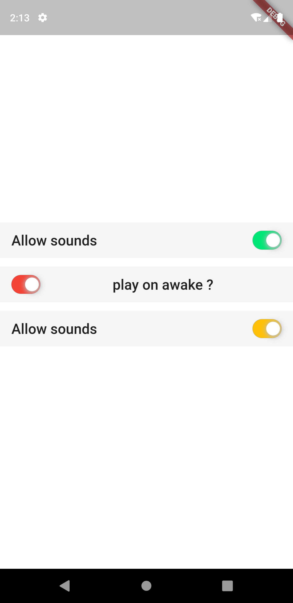
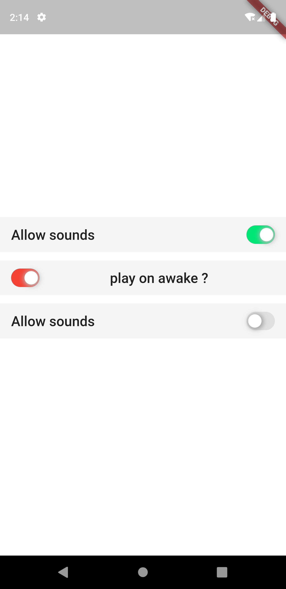
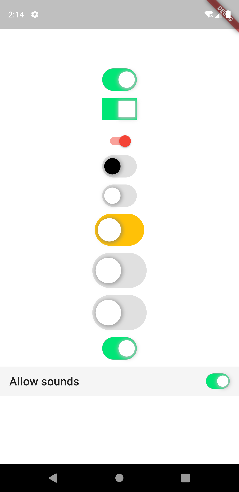
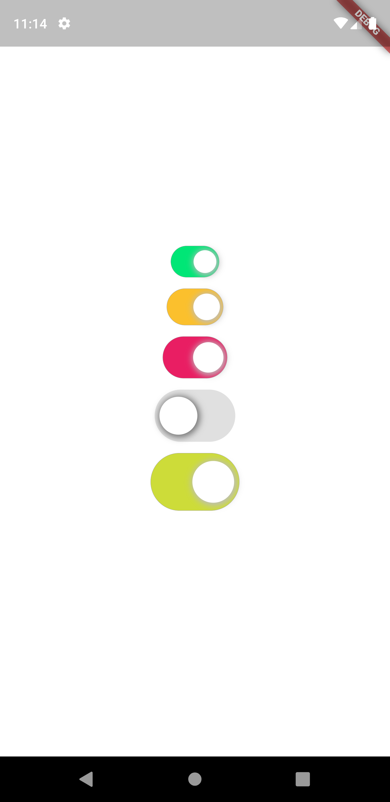

# ios_style_switch

a flutter package for ios style switch and switch Buttons with full costomization (android , iod , web , mac , windows)

## Getting Started

 in this package you can create a ios switch button and taggle  and also a switch list tile  with full customization

 ##screenshoots
        

